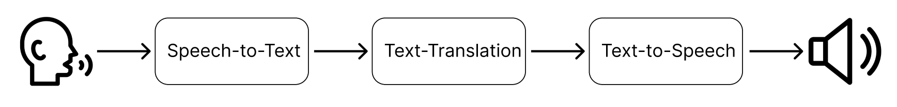

<div style="display: flex; align-items: start;  width: 100%;">
  
  <div>
    <h1 style="margin: 0;">AI-Powered Live Audio Translation</h1>
  </div>
</div>


[link to image](https://cdn.prod.website-files.com/61707b4f874fa22b7482b07e/647e84a46f030f90ae924352_In-person%20Virtual%20Hello-p-1080.png)

## Introduction

This project presents a real-time, multilingual audio translation system that enables seamless speech-to-speech translation. It is especially designed for live use cases such as academic lectures, international meetings, or global events. The system converts live audio input into translated speech using a pipeline that integrates:

<ul>
  <li>Speech-to-Text (STT)</li>
  <li>Text Translation (TT)</li>
  <li>Text-to-Speech (TTS)</li>
</ul>

The result is a live dubbing tool capable of bridging language barriers in real time.




## Features
- Live audio translation via microphone
- Support for both English -> Danish and Danish -> English
- Detailed logging and performance metrics
- Streaming architecture with multiprocessing queues
- Real-time latency tracking
- Graph and CSV output generation


## Requirements
- Python 3.10+ 
- Conda or Mamba
- Microphone (for live input)


## File Descriptions
 <ul>
    <li><code>data/</code> – Audio samples and transcriptions *(not included due to licensing; see **Dataset Preparation Guide (reproducibility)** section)*</li>
    <li><code>pipeline.py</code> – Processes audio files from data folder</li>
    <li><code>pipeline_wlog.py</code> – Same as <code>pipeline.py</code> but saves detailed logs</li>
    <li><code>models/</code> – Models wrapped as modules for use in pipeline</li>
    <li><code>microphone_demo.py</code> – Enables live microphone input to run a demo of the pipeline</li>
    <li><code>processing_results.ipynb</code> – Generates evaluation plots, tables, and CSVs</li>
    <li><code>environment.yml</code> – Conda environment with dependencies</li>
    <li><code>logs/</code> – Runtime logs with latency and transcription data</li>
    <li><code>results/</code> – Evaluation outputs: WER, CER, COMET, latency</li>
    <li><code>images/</code> – Saved plots and diagrams</li>
    <li><code>utils/</code> – Helper function, such as preprocessing or live audio simulation</li>
  </ul>


## Installation of environemnt

1. Create environment with required packages: 
```bash
  conda env create -f environment.yml # or mamba
```
2. Activate env:
```bash
  conda activate '02466_AI_dubbing'
```

3. Create kernel for jupyter:
```bash
  python -m ipykernel install --user --name='02466_AI_dubbing' --display-name "Python ('02466_AI_dubbing')"
```

4. Install KenLM:
  a. *Mac/Linux or Windows via WSL*
  ```bash
  pip install kenlm
  ```

  b. *for native Windows (requires a C++ compiler (e.g. from Visual Studio))*
  ```bash
  pip install -e git+https://github.com/kpu/kenlm.git#egg=kenlm
  ```

5. Update PyTorch 
*(latest version might not be supported via Conda)*
```bash
pip install --upgrade torch, torchaudio
```


## Dataset Preparation Guide (reproducabilty):

Follow these steps to create the dataset for evaluation:

1. **Run Sample Extraction Script**  
   Run the get_dataset.ipynb to get English dataset.

2. **Translate Transcripts**  
   Go to [DeepL Translator](https://www.deepl.com/) and manually translate each English transcript to Danish.

3. **Record Danish Audio**  
   - Use a quiet, noise-free environment.  
   - Record a single female speaker with a Zealandic dialect.  

4. **Trim English and Danish Audio**  
   Manually trim the end of each English and Danish audio segment to perfectly align with its transcript.
   ## Segment Lengths


| **DK_Speaker**    | **Segment length (minutes)** |
|-------------------|------------------------------|
| dk_speaker_1      | 2:13                         |
| dk_speaker_2      | 2:04                         |
| dk_speaker_3      | 2:37                         |
| dk_speaker_4      | 2:41                         |
| dk_speaker_5      | 3:08                         |
| dk_speaker_6      | 3:02                         |
| dk_speaker_7      | 2:17                         |
| dk_speaker_8      | 2:37                         |
| dk_speaker_9      | 3:21                         |
| dk_speaker_10     | 2:34                         |


| **Speaker**       | **Segment length (minutes)** |
|-------------------|------------------------------|
| speaker_1         | 1:53                         |
| speaker_2         | 2:00                         |
| speaker_3         | 1:59                         |
| speaker_4         | 1:54                         |
| speaker_5         | 1:59                         |
| speaker_6         | 1:59                         |
| speaker_7         | 2:00                         |
| speaker_8         | 1:54                         |
| speaker_9         | 1:56                         |
| speaker_10        | 1:59                         |

5. **Structure Dataset Folders**  
   Create folders and name files according to:
```text
data/
├── danish/
│   ├── dk_speaker_1.wav
│   ├── dk_speaker_1_final.txt
│   ├── dk_speaker_2.wav
│   ├── dk_speaker_2_final.txt
│   ├── dk_speaker_3.wav
│   ├── dk_speaker_3_final.txt
│   ├── dk_speaker_4.wav
│   ├── dk_speaker_4_final.txt
│   ├── dk_speaker_5.wav
│   ├── dk_speaker_5_final.txt
│   ├── dk_speaker_6.wav
│   ├── dk_speaker_6_final.txt
│   ├── dk_speaker_7.wav
│   ├── dk_speaker_7_final.txt
│   ├── dk_speaker_8.wav
│   ├── dk_speaker_8_final.txt
│   ├── dk_speaker_9.wav
│   ├── dk_speaker_9_final.txt
│   ├── dk_speaker_10.wav
│   └── dk_speaker_10_final.txt
├── english/
│   ├── speaker_1_final.wav
│   ├── speaker_1_final.txt
│   ├── speaker_2_final.wav
│   ├── speaker_2_final.txt
│   ├── speaker_3_final.wav
│   ├── speaker_3_final.txt
│   ├── speaker_4_final.wav
│   ├── speaker_4_final.txt
│   ├── speaker_5_final.wav
│   ├── speaker_5_final.txt
│   ├── speaker_6_final.wav
│   ├── speaker_6_final.txt
│   ├── speaker_7_final.wav
│   ├── speaker_7_final.txt
│   ├── speaker_8_final.wav
│   ├── speaker_8_final.txt
│   ├── speaker_9_final.wav
│   ├── speaker_9_final.txt
│   ├── speaker_10_final.wav
│   └── speaker_10_final.txt
```


6. **Run Evaluation Script**  
   Use the `pipeline-wlog` script to collect logs for evaluation.

⚠️ Follow TED-LIUM’s CC BY-NC-ND 3.0 license conditions when handling the dataset.


## How to use
<b> Use your microphone for live input:</b> Execute `microphone_demo.py`to capture audio from your microphone and process it in real-time.

<b>Run the pipeline on audio files:</b> Execute `pipeline.py`to process pre-recorded sound files through the full dubbing pipeline. *(data not included due to licensing; see 'Dataset Preparation Guide (reproducibility)' section)*

<b> Generate detailed logs:</b> Execute `pipeline_wlog.py`to process audio files and generate a CSV log for each chunk.

<b> Generate results: </b> Execute `processing_results.ipynb` to generate results CSV, plots and table.

## Technologies Used

  <ul>
    <li><a href="https://github.com/huggingface/transformers">Hugging Face Transformers</a> (Core library for Hugging Face models)</li>
    <li><a href="https://github.com/snakers4/silero-vad">Silero VAD</a> (Voice Activity Detection)</li>
    <li><a href="https://github.com/guillaumekln/faster-whisper">faster-whisper</a> (English ASR)</li>
    <li><a href="https://huggingface.co/CoRal-project/roest-wav2vec2-315m-v2">Røst 315m-v2</a> (Danish ASR via Transformers)</li>
    <li><a href="https://huggingface.co/Helsinki-NLP/opus-mt-en-da">Helsinki-NLP/MarianMT (EN→DA)</a> (Text Translation via Transformers)</li>
    <li><a href="https://huggingface.co/Helsinki-NLP/opus-mt-da-en">Helsinki-NLP/MarianMT (DA→EN)</a> (Text Translation via Transformers)</li>
    <li><a href="https://huggingface.co/microsoft/speecht5_tts">SpeechT5</a> (TTS model via Transformers)</li>
    <li><a href="https://huggingface.co/JackismyShephard/speecht5_tts-finetuned-nst-da">JackismyShepard Danish SpeechT5 fine-tune</a> (Danish TTS model via Transformers)</li>
  </ul>


## Future Work

 <ul>
    <li>Support for additional languages (e.g., Spanish, German, French)</li>
    <li>Global loading </li>
    <li>Local cashing </li>
    <li>More robustness (dynamic silence length and VAD threshold) </li>
    <li>Handle larger pauses </li>
  </ul>


## Authors

- Clara Louise Brodt
- Joseph An Nguyen
- Julius Winkel
- Mads Helle Højgaard


## License

[MIT](https://choosealicense.com/licenses/mit/)

